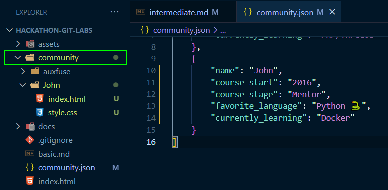
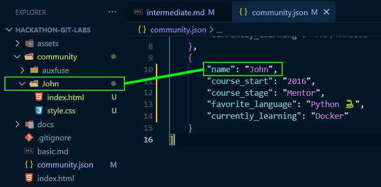
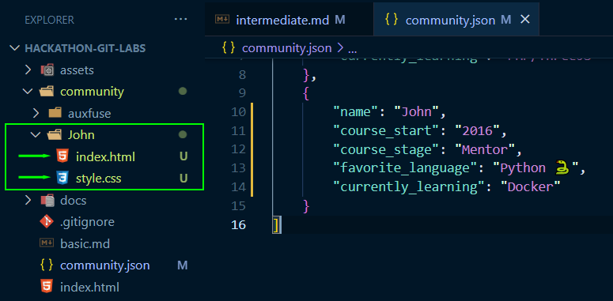

# Intermediate guide to making your first Pull Request (PR)

This guide is intended for those who want to create a PR with some unique content associated with it. 💄💄 Maybe you've done a PR before with a Hackathon team and need a refresher? Or you have just completed the [basic.md](basic.md) portion of this Community Guide Project, and now want to do another PR with a custom developed HTML & CSS Creation?

Then dive in below! This can be your first, or maybe your second...or even your third PR. Don't be afraid to submit a few different JSON objects, and then sub-directories to boot. 🤜

***Any PR satisfying this guide with a custom directory of HTML, CSS, JS will be applicable for Hacktoberfest 2022!*** 🎃🌐💻

If at any stage you want to submit a PR to revise the content you already submitted, then feel free. This project is made for you, the Participant, but over time most of the work in this project will be associated to all of you out there you contribute. 🤗

## 👇 Participant steps: 👇

**_This guide assumes you have read and implemented the steps from the [basic.md](basic.md) file._**

- As per the [basic.md](basic.md) file, please make a branch before doing the work below.

    - ***If you are jumping straight into this guide without having completed the `basic.md`. Please follow that guide in tandem with this guide, found here 👉👉 [basic.md](basic.md).***

- As a side note, you may need to pull down the project from the upstream.
    - Create your branch.
    - Open your terminal/command line in your preferred IDE/Editor and run this command: `git pull upstream main`.
    - At this stage the project files will be updated to whats in the original repo, and you may encounter Merge Conflicts.
    - Where possible, please review and resolve these merge conflicts as they pertain to you and your files only!
        
        If the Merge conflict is in the `community.json` file, please move your inclusion to the bottom of the file as the last JSON Object in the file.

        If you have resolved the Merge Conflicts, please then add, commit, and push to your branch to confirm those changes and make your branch up-to-date. 🌳✔

    - Continue with the below steps to now add your custom creation. 🤗

* In the File Directory, click on the "community" directory:



* Inside the `community` directory, add a folder using the same value as the name (case sensitive) you used in the JSON object for the `name` Key/Value pair.

    For example, if the name in the JSON object was "John", then the name of the directory inside the `community` directory must be also called "John". See next snapshot:



* Inside this newly created directory, please create an `index.html` file and a `style.css` file and link them together appropriately using the `link` HTML element inside the head of the index.html file. [More information on the "link" element.](https://developer.mozilla.org/en-US/docs/Web/HTML/Element/link)



* Before you create your custom creation, add one more Key/Value pair to your JSON onject in the [assets/data/community.json](https://github.com/auxfuse/hackathon-git-labs/blob/main/assets/data/community.json) file to add your new directory to the Showcase.

    Add the following key/value pair, and make sure to add the comma after the `currently_learning` key/value pair:
    ```json
    "showcase": true
    ```

    Your entire JSON object should now look like this:
    ```json
    {
        "name": "auxfuse",
        "course_start": "2019",
        "course_stage": "Alumni",
        "favorite_language": "CSS",
        "currently_learning": "PHP/ThreeJS",
        "showcase": true
    }
    ```

* Then you can create your custom html/css piece.

    Make this unique. Be creative! Maybe it's a small frontend component, a card/navbar/section? What about a little portfolio piece? 🖌🎨🖼 Maybe consider keeping to a height of `100vh`!

    - Keep it unique, but not huge. 😂 While we would love to see you all create beautiful, expansive works of art, the reality is we will still be doing Code Reviews and the management of a huge piece would be a little much.

        Our maintainers of this repo are all voluntary! Give them serious respect, because without them this project wouldn't be possible! 🤜🤜

    Up to here, you will have successfully forked the project, cloned it, opened it, added to a dataset, created a sub-directory, and done some coding too. We do all of this so that the default project structure is left un-mutated and that you are automatically added to the root `index.html` file Community section.
    
    This is a fun way to meet new developers who you may one day be coding alongside of in a team, or asking them for help with a query in the Slack CI community, so please take a look at some of the other creations! And check back often to see all the new ones as they come in. 🤩

    - Once you are happy with your custom piece, create a PR! ↪

        All of the PR steps can be found in [basic.md](basic.md) file, so if you get stuck refer back to it!